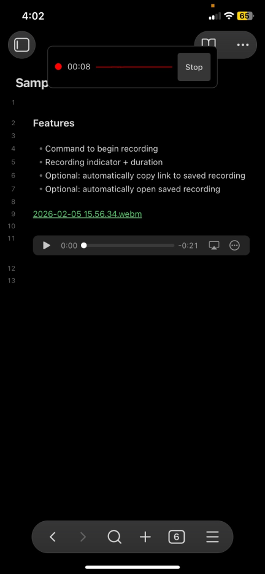

# Obsidian Voice Memos

This exists to provide a visual indicator that an audio file is being recorded on mobile (but it still works on desktop).

## Features

- Command to begin recording
- Recording indicator with duration
- Custom output location
- Optional: automatically copy link to saved recording
- Optional: automatically open saved recording

## Screenshot

